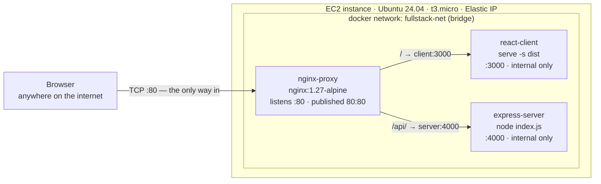
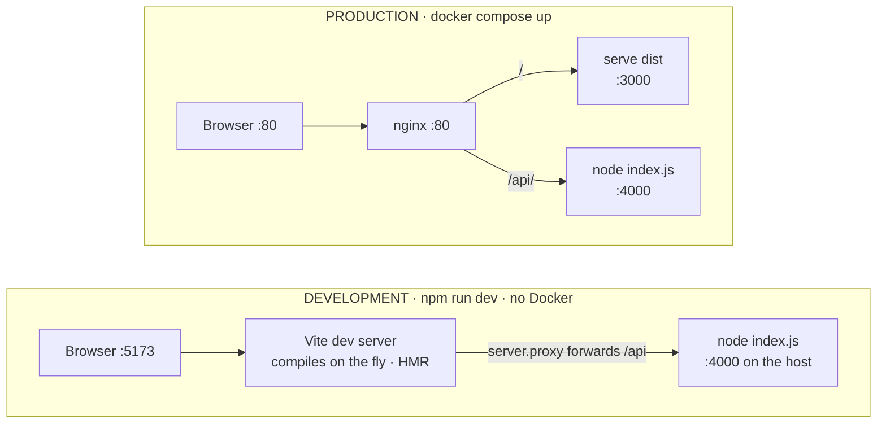
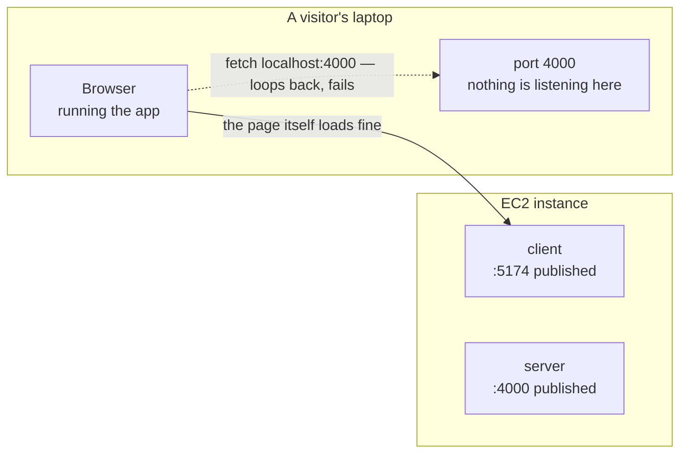
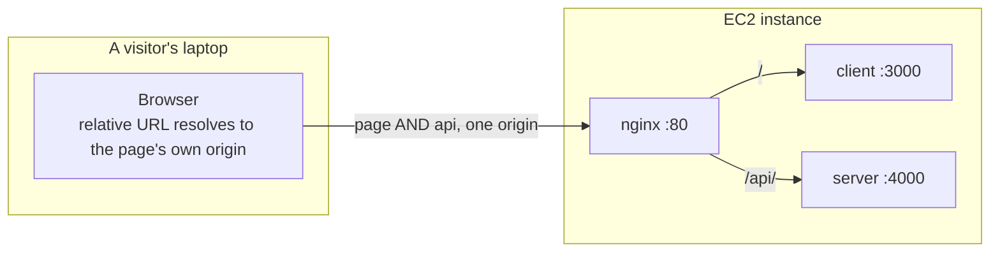
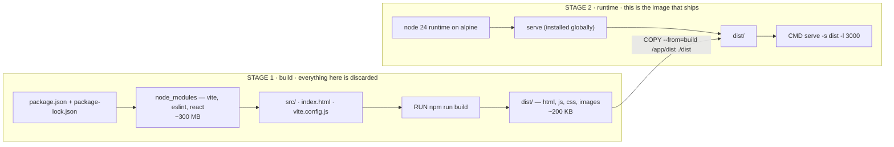
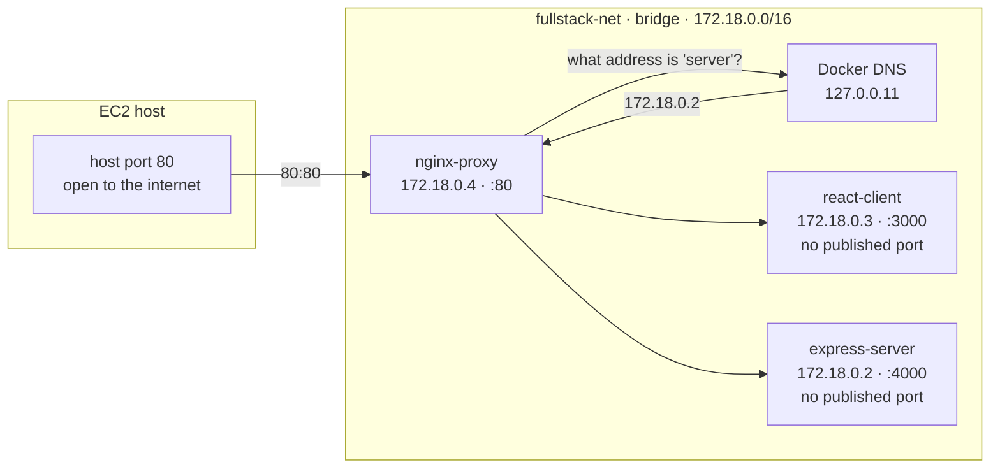
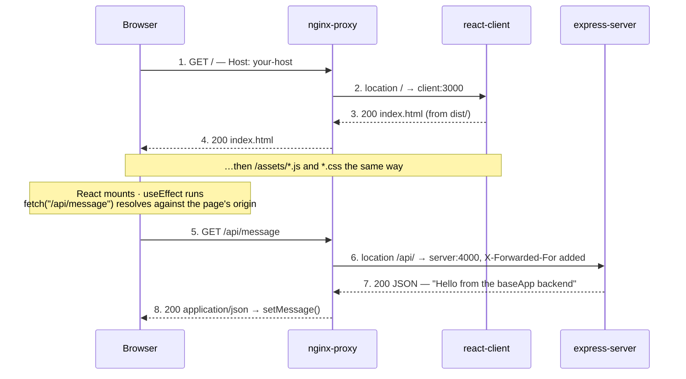
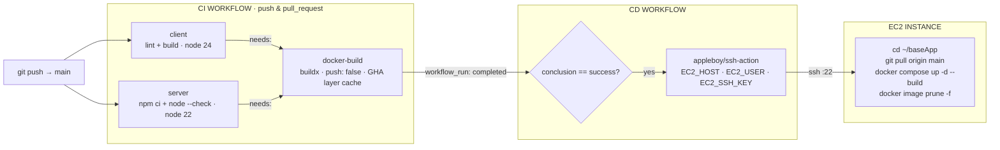
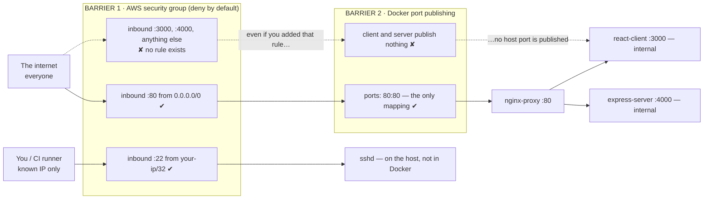

# Anatomy of baseApp

A React client, an Express server, three containers, one reverse proxy, and a
$0 virtual machine in Amazon's data centre. This document walks every layer in
the order a request meets them, and explains why each layer exists.

Written for someone new to this environment — and for explaining the whole
architecture out loud.

**Stack:** React 19 · Express 5 · Nginx 1.27 · Docker Compose · GitHub Actions · Ubuntu 24.04 on EC2

---

## Contents

1. [The shape of it](#1--the-shape-of-it)
2. [The two applications](#2--the-two-applications)
3. [Dockerization](#3--dockerization)
4. [What docker-compose.yml is for](#4--what-docker-composeyml-is-for)
5. [Nginx: what a reverse proxy is for](#5--nginx-what-a-reverse-proxy-is-for)
6. [A request, end to end](#6--a-request-end-to-end)
7. [The pipeline: CI and CD](#7--the-pipeline-ci-and-cd)
8. [Configuring the EC2 instance](#8--configuring-the-ec2-instance)
9. [Interview drill](#9--interview-drill)
10. [Honest gaps](#10--honest-gaps)

---

## 1 · The shape of it

Strip away the jargon and this system is four moving parts: a folder of static
files, a Node process, a traffic cop, and a rented Linux computer.

A visitor types an address into their browser. That address points at a small
virtual machine running in an Amazon data centre. On that machine, **Nginx** is
listening on port 80 — the default port for web traffic. Nginx looks at what was
asked for and hands the request to one of two other programs running alongside it:

- anything that looks like `/api/…` goes to the **Express server**, which computes a JSON answer;
- everything else goes to the **client**, which serves the HTML, JavaScript, and CSS that make up the React app.

All three programs run inside **containers** — isolated, pre-packaged bundles of
software — and a single file, [`docker-compose.yml`](../docker-compose.yml),
describes how they are wired together. That is the whole system. Everything
below is detail.



> **Fig 1** — The production topology. Only Nginx is exposed to the outside
> world; the client and server are reachable only from inside the private Docker
> network, by container name.

---

## 2 · The two applications

### The server is genuinely tiny

[`server/index.js`](../server/index.js) is thirty-three lines. It creates an
Express app, registers one route, and listens:

```js
app.get('/api/message', (req, res) => {
  res.status(200).json({ message: "Hello from the baseApp backend" })
})

const PORT = 4000
app.listen(PORT, "0.0.0.0", () => { ... })
```

> **Why `"0.0.0.0"` and not the default**
>
> A process can listen on one network interface or all of them. `127.0.0.1`
> (a.k.a. `localhost`) means *only accept connections that originate inside this
> machine*. Inside a container, "this machine" is the container itself — so a
> server bound to `127.0.0.1` would refuse Nginx's connection, because Nginx is a
> different container with a different address. `0.0.0.0` means "listen on every
> interface", which is what lets a container accept traffic from its network
> neighbours. This single string is one of the most common reasons a
> containerised app appears dead.

### The client has two different lives

This is the part that confuses most people new to modern front-end tooling:
**a React app is not one program, it is two arrangements of the same code.**

During development you run `npm run dev`, which starts **Vite's dev server**. It
compiles your JSX in memory, on demand, and pushes changes into the open browser
tab without a reload (hot module replacement). It is a live, stateful
development tool.

For production you run `npm run build`. Vite compiles everything once, ahead of
time, into a folder called `dist/`: one `index.html`, one bundled and minified
JavaScript file, one CSS file, and the images. Those files are *completely
static* — there is no React "running on the server". Any program capable of
returning files over HTTP can serve them. In our image, that program is `serve`.



> **Fig 2** — The same source code, two runtimes. `App.jsx` says
> `fetch("/api/message")` in both worlds. A *relative* URL resolves against
> whatever origin served the page, so the identical line of React works behind
> Vite's proxy in development and behind Nginx in production — one line, no
> environment variable, no rebuild.

### The bug that forced all of this

Before the reverse proxy, `App.jsx` called
`fetch("http://localhost:4000/api/message")`. That works perfectly on your own
laptop and is broken for every other human on earth — and understanding *why* is
the single most valuable thing in this document.

`fetch()` runs **in the visitor's browser**, on the visitor's computer. When that
code says `localhost`, the browser resolves it against the machine it is running
on: the visitor's laptop. It never crosses the internet. The request goes looking
for a web server on *their* port 4000, finds nothing, and fails.

**Before** — two origins, and the API call never leaves the laptop:



**After** — one origin, one public port:



> **Fig 3** — The problem the reverse proxy solves. The fix was not "make the API
> reachable" — it was collapsing two origins into one, so the browser never has to
> know where the backend lives.

> **Bonus: the CORS problem disappears**
>
> `server/index.js` still configures the `cors` middleware, listing allowed
> origins. With the proxy in place, that middleware is now essentially
> *vestigial in production*: the browser sees the API and the page on the same
> origin (`http://your-host/`), so it never classifies the request as
> cross-origin, never sends a preflight `OPTIONS`, and never checks response
> headers. "We put a reverse proxy in front, so CORS stopped being a concern" is
> a very strong sentence in an interview.

---

## 3 · Dockerization

Docker's promise is narrow and worth stating precisely: it packages an
application *together with everything it needs to run*, so the thing you tested
is byte-for-byte the thing that runs in production.

### The three words you must not confuse

| Term | What it actually is |
|---|---|
| **Dockerfile** | A recipe. A text file of instructions for building an image. Committed to git. Does nothing on its own. |
| **Image** | The baked result — a read-only, layered filesystem snapshot containing the OS libraries, Node, your code, and your dependencies. Immutable. Shareable. |
| **Container** | A running instance of an image, with a thin writable layer on top. You can start ten containers from one image; delete a container and the image is untouched. |

Recipe → cake → the slice you are eating. The Dockerfile is versioned in git; the
image is built by `docker compose build`; the container is what
`docker compose up` starts.

### The server image, line by line

[`server/Dockerfile`](../server/Dockerfile):

| Instruction | What it does, and why it is in that order |
|---|---|
| `FROM node:22-alpine` | Start from an official image that already has Node 22 installed. **Alpine** is a minimal Linux distribution — roughly 5 MB versus ~350 MB for the Debian-based default. Smaller image = faster pulls, faster deploys, smaller attack surface. |
| `WORKDIR /app` | Create `/app` inside the image and make it the working directory for every following instruction. Avoids repeating absolute paths. |
| `COPY package*.json ./` | Copy *only* the manifests first. This is the layer-caching trick — see below. The `*` catches both `package.json` and `package-lock.json`. |
| `RUN npm install` | Install dependencies into the image. Runs at *build* time, so the finished image already contains `node_modules` — the container never installs anything at startup. |
| `COPY . .` | Now copy the application source. Everything listed in `.dockerignore` is skipped. |
| `EXPOSE 4000` | **Documentation only.** It publishes nothing and opens nothing. It records the port the app listens on so humans and tools can see it. Real exposure happens via `ports:` in Compose. |
| `CMD ["npm", "start"]` | The default command run when a container starts — here, `node index.js`. The array (*exec*) form runs the binary directly rather than through a shell, so the process gets PID 1 and receives stop signals properly. |

### Layer caching: why the COPY is split in two

Every instruction in a Dockerfile produces a **layer** — a diff of the
filesystem. Docker caches these. On a rebuild it walks the instructions from the
top and reuses the cached layer for each one whose inputs are unchanged. The
moment one instruction's inputs change, that layer *and every layer after it* is
rebuilt.

Dependencies change rarely; source code changes constantly. Copying the
manifests and running `npm install` *before* copying the source means the
expensive install step stays cached across the hundreds of builds where you only
touched a component.

| Layer | You edit `src/App.jsx` | You edit `package.json` |
|---|---|---|
| `FROM node:24-alpine` | cached | cached |
| `WORKDIR /app` | cached | cached |
| `COPY package*.json ./` | cached | **rebuilt** |
| `RUN npm install` | cached | **rebuilt** |
| `COPY . .` | **rebuilt** | **rebuilt** |
| `RUN npm run build` | **rebuilt** | **rebuilt** |
| | ≈ 5 seconds | ≈ 60+ seconds |

> **Fig 4** — The cache invalidates at the first changed layer and everything
> below it. That single ordering rule is why `COPY package*.json ./` comes before
> `COPY . .` in both of our Dockerfiles.

### The client image: a multi-stage build

[`client/Dockerfile`](../client/Dockerfile) is the more interesting one, because
building a React app and running it need completely different toolsets.

```dockerfile
# build stage
FROM node:24-alpine AS build
WORKDIR /app
COPY package*.json ./
RUN npm install          # vite, eslint, react, ~300 MB of node_modules
COPY . .
RUN npm run build        # produces /app/dist

# production stage
FROM node:24-alpine      # a brand-new, empty filesystem
WORKDIR /app
RUN npm install -g serve
COPY --from=build /app/dist ./dist   # ← the only thing carried over
EXPOSE 3000
CMD ["serve", "-s", "dist", "-l", "3000"]
```

Two `FROM` lines means two stages. Everything the first stage produced is
discarded except what the second stage explicitly copies out of it. The compiler,
the linter, React itself, the entire `node_modules` tree — none of it ships.



> **Fig 5** — A multi-stage build. Stage 1 is a disposable workshop; stage 2 is
> the shipping crate. The `COPY --from=build` line is the only bridge between
> them. No compiler, no dev dependencies, and no source code reach production.

> **Two details worth knowing about `serve -s dist -l 3000`**
>
> `-l 3000` sets the listening port. `-s` means *single-page-application mode*:
> any request for a path that doesn't match a real file returns `index.html`
> instead of a 404, so client-side routing (`/settings`, `/users/42`) works when
> someone refreshes the page or pastes a deep link. Without `-s`, a React Router
> app 404s on every URL except `/`.

### `.dockerignore`

Both apps have one, and both list `node_modules` first. Without it, `COPY . .`
would upload your host's `node_modules` into the build context — slow, and
actively wrong, because packages compiled for macOS would overwrite the Linux
ones just installed inside the image. It also excludes `.env`, keeping secrets
out of the image layers, which are trivially readable by anyone who has the image.

---

## 4 · What docker-compose.yml is for

A Dockerfile describes *one* container. Nothing in it knows about the other two.
Compose is the file that describes the system.

Without Compose, running this stack means typing three `docker run` commands with
the right flags in the right order, creating a network by hand, and remembering
the volume mount. [`docker-compose.yml`](../docker-compose.yml) replaces all of
that with a declarative description, checked into git, and two words:
`docker compose up`.

```yaml
services:
  server:
    build: ./server              # build from server/Dockerfile
    container_name: express-server
    networks: [fullstack-net]
    restart: unless-stopped

  client:
    build: ./client
    container_name: react-client
    networks: [fullstack-net]
    depends_on: [server]
    restart: unless-stopped

  nginx:
    image: nginx:1.27-alpine     # pulled, not built
    container_name: nginx-proxy
    ports: ["80:80"]             # the only published port
    volumes:
      - ./nginx/default.conf:/etc/nginx/conf.d/default.conf:ro
    networks: [fullstack-net]
    depends_on: [client, server]
    restart: unless-stopped

networks:
  fullstack-net:
    driver: bridge
```

| Key | What it does |
|---|---|
| `build: ./server` | Build this service's image from the Dockerfile in that directory. The directory is also the *build context* — the set of files `COPY` can see. |
| `image: nginx:…` | Don't build; pull a ready-made image from Docker Hub. Nginx is off-the-shelf software, so we only supply configuration. |
| `container_name` | A fixed, human-readable name instead of Compose's auto-generated one. Makes `docker logs express-server` predictable. |
| `ports: "80:80"` | `HOST:CONTAINER`. Punches a hole from the machine's real port 80 into the container's port 80. **Only Nginx has this.** The client and server are deliberately unpublished. |
| `volumes: …:ro` | A *bind mount*: the file on the host appears inside the container at that path, `ro` = read-only. This is why editing `nginx/default.conf` needs no image rebuild — only a container restart. |
| `networks` | Attach the container to a shared, user-defined bridge network. This is what makes name-based service discovery work. |
| `depends_on` | Controls *start order* only. See the gotcha below. |
| `restart: unless-stopped` | Docker restarts the container if it crashes, and again after the host reboots — unless you explicitly stopped it. This is what makes the EC2 box survive a reboot without anyone logging in. |
| `driver: bridge` | A private virtual switch on the host. Containers on it get their own IP addresses and can reach each other; nothing outside can reach in unless a port is published. |

> **Classic interview trap · `depends_on`**
>
> `depends_on` waits for the container to **start**, not for the application
> inside it to be **ready**. Nginx can be up and accepting connections a full
> second before Express has finished booting. It doesn't bite us here — Nginx
> retries on the next request and the first page load is a human clicking a link
> — but on a stack with a database you must add a `healthcheck:` and
> `depends_on: {db: {condition: service_healthy}}`, or the app crashes on startup
> connecting to a database that isn't listening yet.

### Service discovery: how `http://server:4000` resolves

In `nginx/default.conf` we write `proxy_pass http://server:4000/`. There is no
DNS entry for "server" anywhere on the internet. It works because Docker runs an
embedded DNS resolver at `127.0.0.11` inside every container on a user-defined
network, and that resolver knows every service name on that network.



> **Fig 6** — Container names are hostnames. Compose registers each service name
> with Docker's internal DNS, so `server` and `client` resolve to live container
> IPs — and keep resolving after a rebuild assigns new ones. Inside any
> container, `localhost` means *that container* — never the host, never a sibling.

> **Why this matters more than it looks**
>
> Container IPs change every time a container is recreated. If Nginx's config
> hard-coded `172.18.0.2`, the very first redeploy would break it. Referring to
> containers by *name* means the address is resolved fresh, at request time, from
> a registry Docker keeps up to date. It is a tiny, free version of service
> discovery.

---

## 5 · Nginx: what a reverse proxy is for

A *forward* proxy sits in front of clients and hides them from the internet. A
*reverse* proxy sits in front of servers and hides them from the client. Nginx
here is the second kind: from the browser's point of view, there is exactly one
server, and it is Nginx.

Nginx buys us four things at once:

1. **One origin.** Page and API share a scheme, host, and port, so relative URLs work and CORS never enters the picture.
2. **One open port.** Everything else stays on the private Docker network. The blast radius of a misconfigured backend is much smaller.
3. **A stable seam.** The routing rule lives in a config file rather than in compiled JavaScript. Splitting the API onto a different service later is a config edit, not a front-end rebuild and redeploy.
4. **The obvious home for cross-cutting concerns.** TLS termination, gzip, caching headers, rate limiting, and access logs all belong at this layer — configured once, applied to every backend.

### The config, line by line

[`nginx/default.conf`](../nginx/default.conf) is mounted into the container at
`/etc/nginx/conf.d/default.conf`, which the stock Nginx image already includes
from its main config.

| Directive | Meaning |
|---|---|
| `server { }` | One virtual host. A single Nginx process can serve many; we have one. |
| `listen 80;` | Accept plain HTTP on port 80 *inside the container*. Compose maps the host's port 80 onto it. |
| `location /api/ { }` | Match any request path beginning with `/api/`. Prefix matching: `/api/message` matches, `/apidocs` does not. |
| `proxy_pass http://server:4000/api/;` | Forward the request to that address. `server` is resolved by Docker's DNS. The trailing path matters — see below. |
| `proxy_http_version 1.1;` | Speak HTTP/1.1 upstream instead of Nginx's 1.0 default. Enables keep-alive connections and is a prerequisite for WebSocket upgrades later. |
| `proxy_set_header Host $host;` | Pass along the hostname the browser asked for. Without it, the backend sees `server:4000` and any redirect or absolute URL it generates points at an internal name. |
| `X-Real-IP $remote_addr;` | The immediate client's IP. Without this the backend sees only Nginx's container IP for every visitor — useless for logging, rate limiting, or geo rules. |
| `X-Forwarded-For $proxy_add_x_forwarded_for;` | Appends the client IP to any existing chain, so a request through several proxies keeps a full trail. |
| `X-Forwarded-Proto $scheme;` | Tells the backend whether the *original* request was http or https. Essential once TLS is terminated at Nginx — otherwise the app thinks every request is insecure and may redirect-loop. |
| `location / { }` | The catch-all. Nginx prefers the longest matching prefix, so `/api/` always wins over `/` for API paths regardless of block order. |

### The trailing slash on `proxy_pass`

This is the most-asked Nginx interview question and the most common source of
mysterious 404s.

If `proxy_pass` ends with a **URI path** (anything after the `host:port`,
including a bare `/`), Nginx *replaces* the matched `location` prefix with that
path. If it ends with just `host:port` and no path, the request URI is passed
through untouched.

| Browser requests | Matched block in `default.conf` | Upstream receives |
|---|---|---|
| `/` | `location /` → `proxy_pass http://client:3000/` | client sees `/` |
| `/assets/index.js` | `location /` — prefix `/` replaced by `/` | client sees `/assets/index.js` |
| `/api/message` | `location /api/` → `proxy_pass http://server:4000/api/` | server sees `/api/message` ✅ matches the Express route |
| `/api/message` | if we had written `proxy_pass http://server:4000/` ← bare `/` | server sees `/message` ❌ **404** — prefix stripped |

> **Fig 7** — How the matched `location` prefix is rewritten. Our config keeps
> `/api/` on both sides, so Express's route and the browser's URL stay identical —
> the simplest thing to reason about.

---

## 6 · A request, end to end

Put it together. A visitor opens `http://<your-host>/` and this is every hop, in
order.



> **Fig 8** — Two round trips, both through the same door. Hops 2, 3, 6, and 7
> never touch the public internet — they cross a virtual switch inside one machine.

---

## 7 · The pipeline: CI and CD

**CI** (continuous integration) answers "is this change sound?". **CD**
(continuous deployment) answers "get the sound change onto the server". They are
two files, and they are deliberately separate.

### CI — [`.github/workflows/ci.yml`](../.github/workflows/ci.yml)

Runs on every push and every pull request targeting `main`, in three jobs:

- **client** — `npm ci`, `npm run lint`, `npm run build` on Node 24. `npm ci`
  (not `install`) installs strictly from the lockfile, so CI tests the exact
  dependency tree you committed.
- **server** — `npm ci` and `node --check index.js` on Node 22, matching the
  version in `server/Dockerfile`. There is no test suite yet; the syntax check is
  an honest placeholder.
- **docker-build** — `needs: [client, server]`, so it only starts once both pass.
  Builds both images with Buildx and a GitHub Actions layer cache, and pushes
  nothing. It exists to catch "works on my machine, fails in the image" before
  deployment, not after.

`concurrency: cancel-in-progress: true` means a new push to the same branch
cancels the previous run, so you aren't paying for CI on code nobody will merge.

### CD — [`.github/workflows/cd.yml`](../.github/workflows/cd.yml)

Triggered by `workflow_run` on the CI workflow completing on `main`, and gated by
`if: github.event.workflow_run.conclusion == 'success'`. It opens an SSH session
to the instance with the private key from the `EC2_SSH_KEY` secret and runs four
commands.

```bash
cd ~/baseApp
git pull origin main
docker compose up -d --build
docker image prune -f
```

| Command | Why |
|---|---|
| `git pull origin main` | Fetch the new source onto the instance. The instance builds from source rather than pulling a pre-built image — see the trade-off in §10. |
| `docker compose up -d --build` | `--build` rebuilds any image whose inputs changed; `-d` detaches so the SSH session can exit. Compose recreates only the containers whose image or config actually changed, and leaves the rest running. |
| `docker image prune -f` | Each rebuild leaves the previous image untagged ("dangling"). On a 30 GB free-tier disk these accumulate until a deploy fails with "no space left on device". This one line prevents a very common outage. |

`concurrency: cancel-in-progress: false` on CD is the opposite choice from CI, and
deliberate: cancelling a deploy halfway through leaves the server in an unknown
state. Deploys queue instead.



> **Fig 9** — The pipeline. The `needs:` edge and the `conclusion == 'success'`
> gate are the two places where the pipeline refuses to continue — everything else
> is plumbing. Separate workflows, not one: CI runs on every branch and PR; CD
> runs only after CI is green on `main`.

---

## 8 · Configuring the EC2 instance

EC2 — Elastic Compute Cloud — rents you a virtual machine. You get a bare Ubuntu
box with an IP address and root access, and everything else is your
responsibility.
[`scripts/aws-ec2-deploy-setup.sh`](../scripts/aws-ec2-deploy-setup.sh) is an
interactive wizard that walks a human through the ten steps, because most of them
can only be done by a person clicking in the AWS console.

Each stage below is *what* we did and, more importantly, *why* — the "why" is
what an interviewer is actually testing.

### 1 · Account and region

A region is a physical cluster of data centres — `us-east-1` is Northern
Virginia, `ap-south-1` is Mumbai. You choose one because latency is governed by
the speed of light: every 100 km of distance costs about a millisecond each way.
Pick the region closest to your users. The free tier gives 750 hours per month of
a `t2.micro`/`t3.micro` for 12 months — 750 hours is slightly more than a 31-day
month, so one instance can run continuously at no cost.

### 2 · Find your own public IP

The wizard calls `https://checkip.amazonaws.com` to detect it. This is purely
groundwork for the next step: we want SSH restricted to *your* address rather
than the entire internet.

### 3 · Create an SSH key pair

SSH authenticates with asymmetric cryptography rather than a password. AWS
generates a key pair, installs the **public** half on the instance, and hands you
the **private** half as `baseapp-key.pem` — once. There is no second download;
lose it and you lose access to the machine.

> **Why `chmod 400`**
>
> The wizard sets the file to read-only, owner-only. OpenSSH *refuses to use* a
> private key that other users on your machine can read, and fails with
> "UNPROTECTED PRIVATE KEY FILE". This is a feature: a key readable by every
> process on a shared machine is not a secret.

### 4 · The security group — a firewall in front of the machine

A security group is a stateful, deny-by-default virtual firewall attached to the
instance. Nothing gets in unless a rule allows it. We created exactly two inbound
rules:

| Port | Source | Reason |
|---|---|---|
| 22 (SSH) | `your-ip/32` | Administration and automated deploys. `/32` means exactly one address. Port 22 open to `0.0.0.0/0` gets found by automated scanners within minutes and hammered with credential-stuffing attempts continuously. |
| 80 (HTTP) | `0.0.0.0/0` | The public web. This has to be open to everyone — it's the product. |

Ports 3000 and 4000 are **not** in the list. "Stateful" means you don't need
matching outbound rules — a reply to an allowed inbound connection is always
permitted. Outbound is left fully open so the instance can pull Docker images and
packages.



> **Fig 10** — Defence in depth. Two independent mechanisms would each have to be
> misconfigured before the backend became reachable — the AWS-side firewall rule,
> and the Compose `ports:` mapping. Neither one depends on the other.

### 5 · Launch the instance

Ubuntu Server 24.04 LTS ("Long Term Support" — five years of security patches,
the sane default for a server), `t2.micro`/`t3.micro`, the key pair from step 3,
the security group from step 4, default storage. The instance boots in under a
minute and is a real Linux machine you can SSH into.

### 6 · Attach an Elastic IP

A default EC2 public IP is *ephemeral*: stop and start the instance and you get a
different address. That would break the DNS record, break the `EC2_HOST` GitHub
secret, and break every bookmark. An **Elastic IP** is a static address allocated
to your account and associated with the instance; it survives stop/start. It is
free while attached to a running instance, and charged a small hourly rate when
allocated but idle — AWS's way of discouraging address hoarding.

### 7 · Install Docker and git

```bash
curl -fsSL https://get.docker.com | sudo sh
sudo usermod -aG docker $USER
sudo apt-get update -y && sudo apt-get install -y git
```

The instance ships with neither. The middle line is the interesting one: the
Docker daemon's socket is owned by `root`, so every command would otherwise need
`sudo`. Adding your user to the `docker` group lets the deploy script run
`docker compose` non-interactively over SSH — a `sudo` password prompt would hang
an automated deploy forever. Group membership is only read at login, which is why
you must log out and back in for it to take effect.

### 8 · Clone the repo and do one manual run

Clone into `~/baseApp` — the exact path `cd.yml` expects — then run
`docker compose up -d --build` by hand, once. Doing the first deploy manually
separates two classes of failure: "the app doesn't work on this machine" and
"the automation doesn't work". Debugging both at once through GitHub Actions logs
is miserable.

Verification is done from *inside* the SSH session with `curl`, so no extra ports
need opening to test:

```bash
curl -I localhost/              # nginx → client
curl -s localhost/api/message   # nginx → express
```

### 9 · Add the three GitHub secrets

| Secret | Value | Used for |
|---|---|---|
| `EC2_HOST` | the Elastic IP | Where to SSH. |
| `EC2_USER` | `ubuntu` | The default login user on Ubuntu AMIs (Amazon Linux uses `ec2-user`). |
| `EC2_SSH_KEY` | full contents of the `.pem` | The private key the action authenticates with, BEGIN/END lines included. |

GitHub encrypts these at rest, masks them in logs, and does not expose them to
workflows triggered by forked pull requests. The wizard writes the non-sensitive
bookkeeping (region, key-pair name, host) to a gitignored `.env` for its own
re-runs, and **deliberately never writes the private key there** — it goes
straight from the file on your disk to GitHub's secret store.

### 10 · Verify the whole pipeline

Push a trivial change to `main`, watch CI go green, watch CD start automatically,
re-run the `curl` checks. Only now is the loop closed: an edit on your laptop
reaches the public internet with no further human action.

---

## 9 · Interview drill

Read the question, answer it out loud, then check yourself against the answer.

<details>
<summary><b>Why do you need Nginx at all? The client container already serves HTTP.</b></summary>

Three reasons, in order of importance. **One origin:** without it the page and
the API live on different ports, which means either hardcoding a backend URL into
the front-end bundle or dealing with CORS — and a hardcoded `localhost` URL breaks
for every visitor who isn't sitting at the server. **One open port:** the client
and server containers publish nothing, so the only thing an attacker can reach is
Nginx. **One place for cross-cutting concerns:** TLS, gzip, caching headers, rate
limiting, and access logging are configured once at the edge instead of
separately in every service.
</details>

<details>
<summary><b>What's the difference between an image and a container?</b></summary>

An image is an immutable, layered filesystem snapshot — the build output. A
container is a running process using that image as its root filesystem, with a
thin writable layer on top. One image, many containers. Delete a container and
the image is untouched; that's why the containers are disposable and all state
must live outside them.
</details>

<details>
<summary><b>Your React app calls <code>fetch("/api/message")</code>. Trace exactly what happens.</b></summary>

The browser resolves the relative path against the page's origin, giving
`http://<host>/api/message`. That leaves the visitor's machine over the public
internet to the Elastic IP on port 80. The AWS security group allows it. Docker's
port mapping forwards host `:80` to the nginx container's `:80`. Nginx matches
`location /api/` — the longest matching prefix wins over `location /` — and
proxies to `http://server:4000/api/`, resolving `server` through Docker's
embedded DNS at `127.0.0.11` to the express container's IP on the bridge network.
Express matches its `/api/message` route and returns JSON. The response retraces
the path.
</details>

<details>
<summary><b>Why is <code>COPY package*.json ./</code> a separate line from <code>COPY . .</code>?</b></summary>

Layer caching. Docker rebuilds from the first instruction whose inputs changed
and every layer after it. Dependencies change rarely, source changes constantly —
so installing dependencies *before* copying source keeps the slow `npm install`
layer cached across the vast majority of builds. Reverse the two lines and every
one-character edit reinstalls the whole dependency tree.
</details>

<details>
<summary><b>What does a multi-stage build get you here?</b></summary>

Vite, ESLint, React, and roughly 300 MB of `node_modules` are needed to *produce*
`dist/` and are useless for *serving* it. Stage one does the build; stage two
starts from a clean base image and copies only `dist/` across. The shipped image
contains no compiler, no dev dependencies, and no source code — smaller to
transfer, faster to deploy, and a much smaller attack surface.
</details>

<details>
<summary><b>Does <code>EXPOSE 4000</code> make port 4000 reachable?</b></summary>

No. `EXPOSE` is metadata — it documents the port for humans and tooling and opens
nothing. Reachability comes from `ports: "80:80"` in Compose (or `-p` on
`docker run`). Our server container has `EXPOSE 4000` and is still completely
unreachable from outside the host, which is exactly what we want.
</details>

<details>
<summary><b>How does Nginx find the backend if container IPs change on every rebuild?</b></summary>

It doesn't use IPs. Compose registers each service name with Docker's embedded
DNS resolver on the user-defined bridge network, so `server` and `client` are
resolvable hostnames inside any container on that network. The name is resolved
fresh, so a rebuilt container with a new IP is picked up automatically.
Hardcoding `172.18.0.2` would break on the first redeploy.
</details>

<details>
<summary><b>Does <code>depends_on</code> guarantee the backend is ready before Nginx starts?</b></summary>

No — it only orders container *start*, not application *readiness*. Express may
still be booting when Nginx begins accepting connections. It's tolerable here
because the first request is a human clicking a link a second later. For a stack
with a database you'd add a `healthcheck:` to the dependency and use
`condition: service_healthy`, or make the app retry its connection on startup.
</details>

<details>
<summary><b>Why restrict SSH to one IP but leave HTTP open to the world?</b></summary>

They have different threat models. Port 80 *is* the product — it must be open to
everyone. Port 22 is administrative: nobody but you needs it, and an open port 22
is discovered by automated scanners within minutes and subjected to continuous
brute-force attempts. Narrowing the source to `your-ip/32` removes essentially
all of that traffic at zero cost to legitimate use.
</details>

<details>
<summary><b>Why an Elastic IP instead of the default public IP?</b></summary>

The default is ephemeral — stop and start the instance and it changes. That would
silently break the `EC2_HOST` secret that CD depends on, plus any DNS record
pointing at it. An Elastic IP is a static address held by your account and
re-associable, so the instance's identity survives a restart.
</details>

<details>
<summary><b>Why is CD a separate workflow instead of a job inside CI?</b></summary>

Different scopes and different failure semantics. CI runs on every branch and
every pull request; deploying from those would be wrong. CD is gated on
`workflow_run` with `conclusion == 'success'` and `branches: [main]`, so it fires
only after a green CI on the default branch. They also want opposite concurrency
policies — CI cancels superseded runs to save time, CD refuses to cancel so a
deploy is never interrupted midway.
</details>

<details>
<summary><b>What does <code>docker image prune -f</code> prevent?</b></summary>

A slow disk-full outage. Every `--build` creates new images and leaves the
previous ones untagged and dangling. On a 30 GB free-tier volume those accumulate
over dozens of deploys until a build fails with "no space left on device" —
typically weeks after anyone last touched deployment, which makes it hard to
diagnose.
</details>

---

## 10 · Honest gaps

Knowing what your architecture doesn't do is more persuasive than claiming it
does everything. Every item here is a deliberate trade-off, not an oversight.

### No HTTPS

Traffic is plain HTTP. Everything a visitor sends is readable in transit. The fix
is well-trodden: point a domain at the Elastic IP, open port 443 in the security
group, and add a certificate — either Certbot with a webroot challenge, or
swapping the Nginx image for something like Caddy that handles certificates
automatically. Nginx is already the right place for it, which is the point:
*only the proxy config changes*.

### Building on the production server

CD runs `docker compose up -d --build` on the instance, so the box compiles the
React app itself. That's simple and has no registry to manage, but it means a
`t3.micro` with 1 GB of RAM does a Vite build during deploy, and the artifact CI
validated is not literally the artifact that ships — it's rebuilt from the same
source. The industry-standard alternative: CI builds and pushes tagged images to
a registry (ECR, GHCR), and the server only pulls. Rollback then becomes changing
a tag rather than reverting a commit and rebuilding.

### Deploy causes a brief outage

Recreating containers drops requests for a second or two. Fine for this app;
unacceptable for a real service. The answers are health checks plus a rolling or
blue-green strategy — which is the point at which people usually reach for an
orchestrator instead of Compose.

### Single point of failure

One instance, one availability zone, no backups, no monitoring. If the box dies,
the site is down until someone notices and rebuilds it. Appropriate for a
portfolio project — worth naming explicitly rather than being caught by it.

### Small pieces of drift

- The wizard's verification step still checks `localhost:5174`, which predates
  the Nginx change — nothing listens there now. It should check `localhost/` and
  `localhost/api/message` instead.
- `server/index.js` still carries the `// add production url` CORS comment. Since
  the proxy makes everything same-origin, that middleware no longer does anything
  in production — it should either be removed or kept deliberately, with a note
  saying why.
- Both Dockerfiles use `npm install` while CI uses `npm ci`. Switching the images
  to `npm ci` would make the built image use the exact lockfile tree CI validated.

---

The through-line, if you only remember one thing: **every layer here exists to
remove a piece of knowledge from the layer above it.** The browser doesn't know
where the backend lives. The containers don't know what host they're on. The
Dockerfiles don't know about each other. Compose doesn't know about AWS. That is
what makes each piece replaceable — and being able to say which piece you'd
replace first is what an interviewer is listening for.
